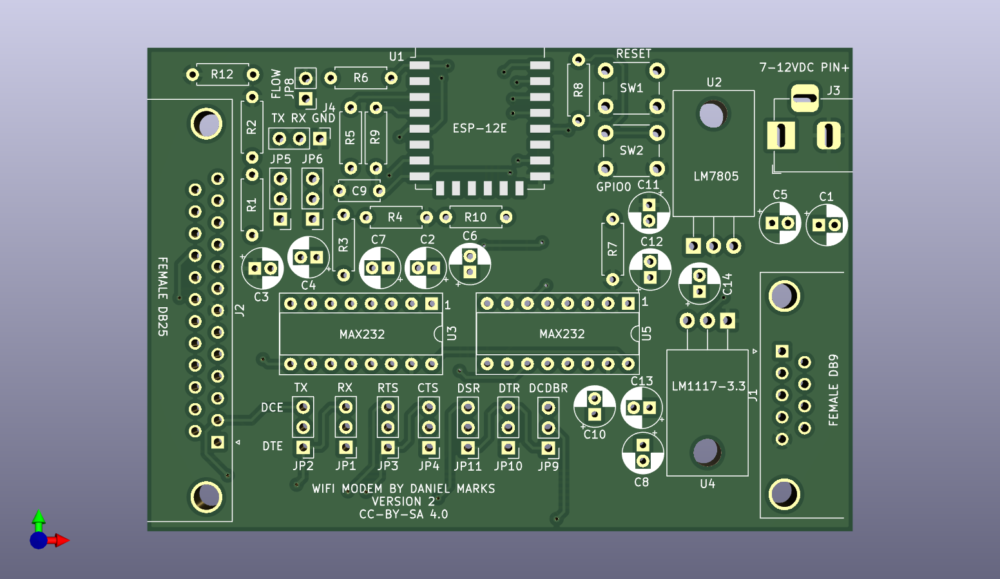

# WiFi Modem



This is a simple layout for connection a ESP12E to a serial port so that a serial to wireless gateway can be used.  It connects RTS/CTS for flow control (when supported) and has DB9 female/male and DB25 female/male connectors.  The particular gender of the connector can be mounted on the side of the board indicated by the silkscreening.  DB25 male is used to connect directly to an Apple Super Serial Card.  DB25 female is the standard connection of old-style dialup modems.  There are jumpers that swap TXD/RXD, RTS/CTS, and DTR/DSR to implement a built-in null modem changer.

There are several types of firmware that could be used on it.

https://github.com/jeelabs/esp-link

ESP Link is a firmware that enables remote access to a microcontroller or serial port through a web page or TCP port.

https://github.com/dhansel/WifiModem

https://github.com/jsalin/esp8266_modem

https://github.com/maccasoft/WifiModem/blob/master/WifiModem.ino

https://github.com/ssshake/vintage-computer-wifi-modem

https://github.com/stardot/esp8266_modem/wiki

https://github.com/RolandJuno/esp8266_modem    (implements CTS)

https://github.com/bozimmerman/Zimodem

A firmware image "zimodem.ino.nodemcu-3.4.bin" may be downloaded from:

http://subethasoftware.com/files/zimodem/

For using with ZiModem, use the following settings:

```
ATS47=5
OK
ATS49=15
OK
ATS51=13
OK
ATS53=12
OK
ATS55=14
OK
ATS57=4
OK
ATB9600
OK
AT&W
```
(default baud rate 9600 for example)

If you use the Zimodem firmware (current version 3.7.0 in that directory) that is in the "zimodem-firmware" directory, it is already compiled to point DTR/DSR/RI/RTS/CTS to the correct GPIO pins.  The default baud rate is 1200.  You can use esptool.py or the flash download tool to load it to the address 0x0000.
